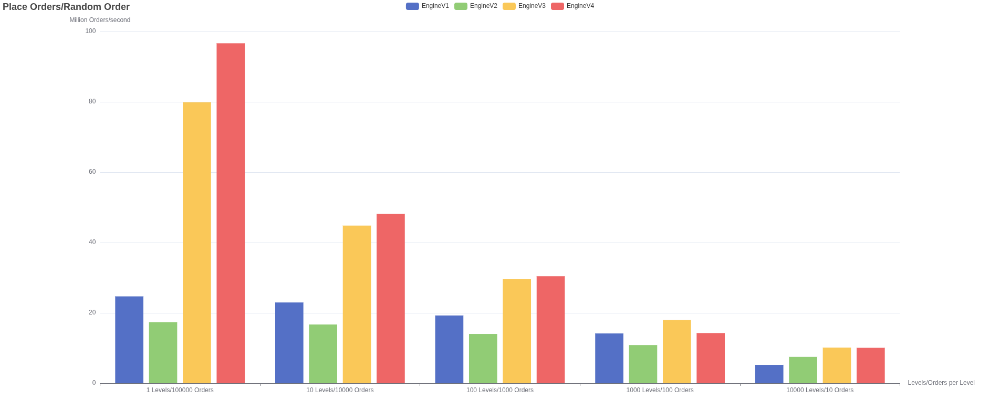
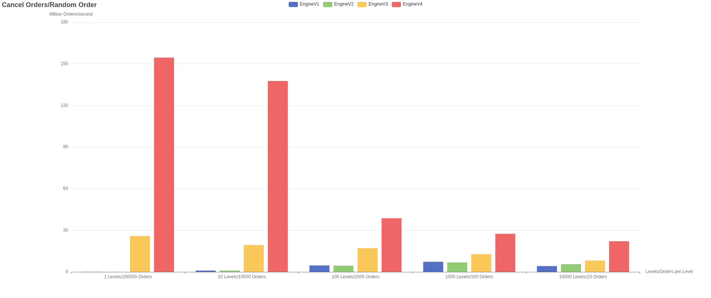
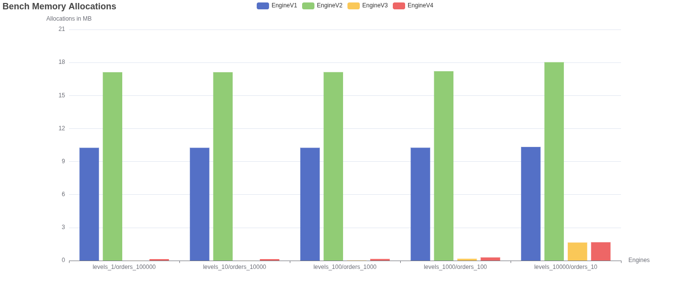

# High Performance Order Book Matching in rust
[](https://github.com/Chuck-ie/order-book/actions/workflows/rust.yml)

### Overview
An [order book](https://www.investopedia.com/terms/o/order-book.asp) matching engine is the core of every trading exchange. Even small
inefficencies can quickly build up at scale, making it a great project for low level optimizations. This project implements 
four order book engines in rust, each using different underlying data structures, with later versions introducing unsafe rust or custom memory
layouts. It then benchmarks each engine and compares them in memory allocation, memory growth, place order throughput, cancel order throughput 
and finally, place order throughput over time. The following engines have been implemented:

1. EngineV1 (Vec only)
2. EngineV2 (BTreeMap)
3. EngineV3 (Slotmap)
4. EngineV4 (Slotmap + Arena allocator)

### Results
1. Place order throughput over time (higher is better)


2. Place order throughput with M orders per N price levels in random order (higher is better)


3. Cancel order throughput with M orders per N price levels in random order (higher is better)


4. Memory allocations with M orders per N price levels (lower is better)


5. Memory growth with M orders per N price levels (lower is better)


<details open>
<summary>V3 and V4 perf stat comparisons at 100M orders</summary>
<br>

| Metric | EngineV3 | EngineV4 | Factor |
|--------|----------|----------|--------|
| Throughput | 16.8 M/s | 21.8 M/s | **1.3×** |
| dTLB loads | 143,758,991 | 901,819 | **160×** |
| Page faults | 292,452 | 2,718 | **107×** |
| L1-dcache miss rate | 3.5% | 3.2% | – |
| Stalled frontend cycles | 7.2B | 6.1B | 1.2× |
| Branch misses | 4.4% | 4.5% | - |

dTLB and page fault reduction comes from the arena allocator using memmap2 mapped
hugepages (8 x 1GB huge pages), drastically reducing the number of TLB entries needed
at scale. The effect varies a lot. With shorter benchmarks (1M orders) the factor
is ~7×, with longer benchmarks (100M orders) it can even reach >100×.
</details>

### Engine evolution over time
V1 is the simplest implementation with price levels stored in a sorted Vec, each holding its orders in arrival order. V2 is nearly
identical, only swapping the Vec for a BTreeMap with the expectation that random access e.g. matching all orders starting at price level N onward
would be faster. Early benchmarks pointed in that direction, but the final results show both engines performing nearly identically, except that 
the memory allocation overhead is almost 2x that of V1. This makes a lot of sense. V1's Vec uses binary search for price level lookups, which is 
O(log n), the same time complexity as V2's BTreeMap access. In addition to that, a BTreeMap has to manage more internal state compared to a simple 
Vec, which the result of benchmark 4. shows. Both engines also maintain a separate HashMap for O(1) order lookups by id, which becomes relevant
when comparing against V3 and V4.

V3 has significant gains in performance in almost every benchmark. Instead of using a HashMap for order lookup, it uses a custom built SlotMap 
for that, as well as using a SlotMap for each price level. This completely eliminates hash computation, tree rebalancing or Vec resizing
overhead and replaces it with much faster index based O(1) access for inserts and deletes. V4 takes this further, by overhauling how orders are stored 
entirely. V1 through V3 all separate order ids from the actual data of an order, which wastes cpu cycles on a second lookup. In addition to that, 
V4 also introduces a custom arena allocator that reduces heap allocation pressure, by allocating a massive Vec of slots and splitting them into index
based chunks to be used by its slotmaps. Additionally the arena uses memmap2 to try request hugepages of up to 1GB per hugepage, which reduces dTLB loads. 
However this does not help with l1 cache misses, since the SlotMap trades O(1) inserts and removals for worse cache locality. These tradeoffs 
still make V4 the fastest engine in terms of memory allocations, memory growth, pure order throughput and also completely eliminates the jitter that 
even V3 was suffering from.

### What I learned
1. How bad heap allocated pointer jumps can impact performance
In the initial arena implementation, [which can be found here](archive/old_v4_slot_map_arena.rs), I just stored a preallocated list of SlotMaps to be
used inside a Vec, so that when a price level gets created, I can just get one already existing SlotMap and skip slot memory allocation completely. Turns 
out, compared to V3, this basically halved the performance and made it worse compared to even V1 and V2 in some aspects. This was because heap lookups
introduced massive L1 cache misses.

2. Low level rust and how godbolt helped me write better unsafe rust
When I tried optimizing for the V4 version, I wanted to try out some more unsafe rust for things that are logically safe e.g. unchecked index lookup
or casting a Slot, which is an enum, to either the Free or Occupied version without additional if branching overhead. I was pasting different unsafe
code into [Godbolt](https://godbolt.org/) to see what the compiled assembly might look like and to my surprise, rust provides a very cool feature
that helped make some of my unsafe code, much safer, which was std::hint::unreachable_unchecked(). Here is an example:

```rust
/// Popping the last element in a Vec

/// Version 1
#[unsafe(no_mangle)]
pub fn pop_unchecked(data: &mut Vec<usize>) -> usize {
    let new_len = data.len() - 1;
    unsafe {
        data.set_len(new_len);
    }

    unsafe { *data.as_ptr().add(new_len) }
}

/// Version 2
#[unsafe(no_mangle)]
pub fn pop_hint_unreachable(data: &mut Vec<usize>) -> usize {
    let Some(index) = data.pop() else {
        unsafe { std::hint::unreachable_unchecked() }
    };

    index
}
```

Both versions compile to the exact same assembly, but version 2 using the hint is much simpler to reason about and avoids simple index calculation errors, similar
to index based for loops, while still achieving the same performance.

### About benchmark results
First of all, benchmark 1., 4., and 5. are great benchmarks to give an insight to how well each engine performs. 1. showcases jitter and how well each engine
performs over time, which 2. and 3. do not do. 

Some of the benchmarks have to be taken with a grain of salt. Benchmark 2. and 3. particularly are used to show that each version scales differently with increasing
numbers of price levels, however these results can fluctuate greatly as they don't take into account how this scales over time, as orders for these benchmarks are
only inserted on one side and there is no matching happening. However in contrast to those two, benchmarks 1., 2., and 3. genuinely give a great insight into
each engine, as the show memory behavior as well as performance over time. V1 and V2 clearly do not scale well, as performance continues to degrade, which the other
benchmarks did not show. V3 has massive jitter and terrible p99 performance. V4 on the other hand solves basically all of these problems, as it has a steady throughput,
stable memory and only small jitter.


### Reproduce benchmark results
0. (Optional) to enable huge pages for the arena allocator to have a measurable impact
```code
# enable huge pages 
sudo sh -c 'echo always > /sys/kernel/mm/transparent_hugepage/enabled'

# set the number of huge pages to 8 
sudo sysctl -w vm.nr_hugepages=8

# set the number of 1GB huge pages to 8 for a total of 8GB of memory that the arena uses per default
sudo bash -c 'echo 8 > /sys/kernel/mm/hugepages/hugepages-1048576kB/nr_hugepages'

# run to see if 8 (or optionally some other number) have been enabled
cat /sys/kernel/mm/hugepages/hugepages-1048576kB/free_hugepages
```

1. Run the benchmarks and optionally write criterion results to a text file
```bash
cargo bench --bench bench_place_orders --bench bench_cancel_orders > benches/results/criterion_results.txt
```

2. (Optional) Parse criterion results to csv tiles
```bash
cd benches/results/ && python parse_criterion_results.py
```

3. Generate charts based on the benchmark results
```bash
cargo bench --bench create_charts
```

### Testing the implementations
```bash
cargo test
```
