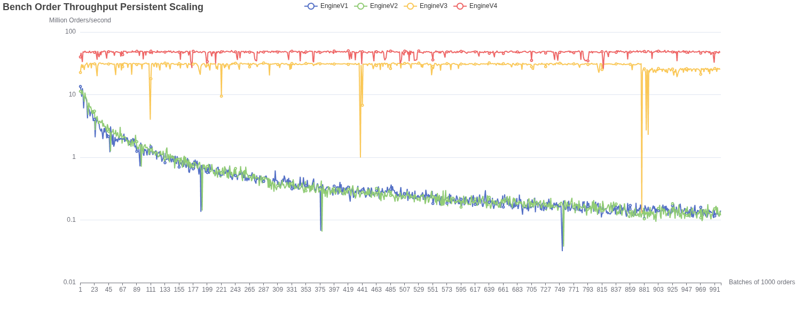
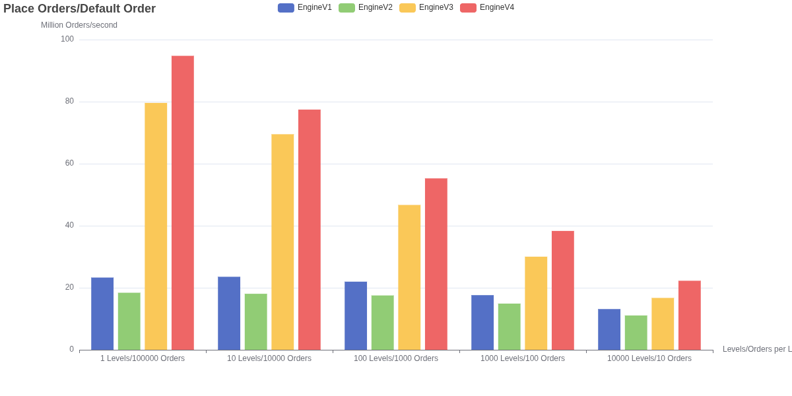
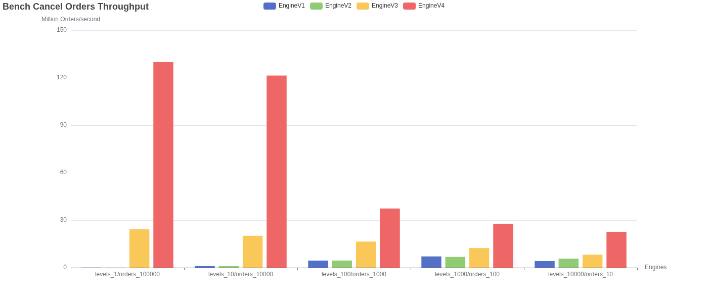
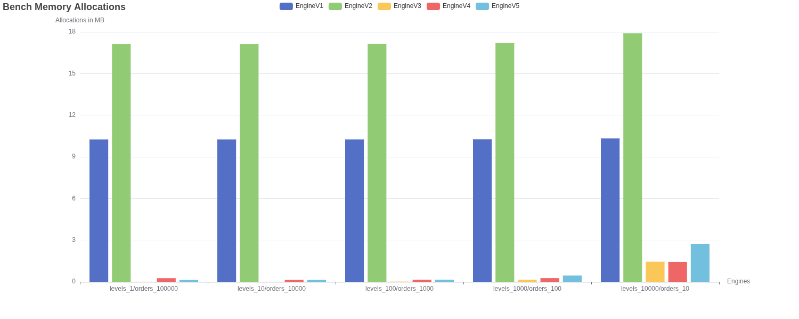
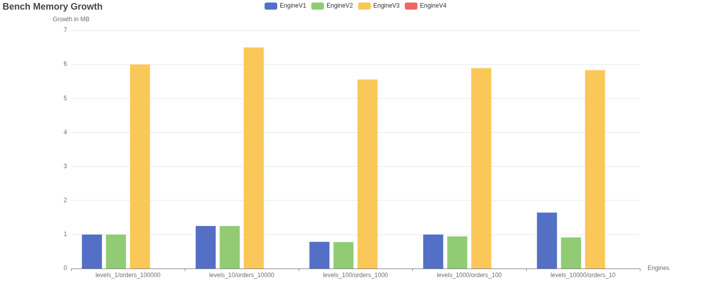

# High Performance Order Book Matching in rust
### Overview
An [order book](https://www.investopedia.com/terms/o/order-book.asp) matching engine is the core of every trading exchange. Even small
inefficencies can quickly build up at scale, making it a great project for low level optimizations. This project implements 
four order book engines in rust, each using different underlying data structures, with later versions introducing unsafe rust or custom memory
layouts. It then benchmarks each engine and compares them in memory allocation, memory growth, place order throughput, cancel order throughput 
and finally, place order throughput over time. The following engines have been implemented:

1. EngineV1 (Vectors only)
2. EngineV2 (BTreeMap)
3. EngineV3 (Slotmap)
4. EngineV4 (Slotmap + Arena allocator)

### Results
1. Place order throughput over time (higher is better)


2. Place order throughput with M orders per N price levels (higher is better)


3. Cancel order throughput with M orders per N price levels (higher is better)


4. Memory allocations with M orders per N price levels (lower is better)


5. Memory growth with M orders per N price levels (lower is better)


### Engine evolution over time
V1 is the simplest implementation with price levels stored in a sorted Vec, each holding its orders in arrival order. V2 is nearly
identical, only swapping the Vec for a BTreeMap with the expectation that random access e.g. matching all orders starting at price level N onward
would be faster. Early benchmarks pointed in that direction, but the final results show both engines performing nearly identically, except that 
the memory allocation overhead is almost 2x that of V1. This makes a lot of sense. V1's Vec uses binary search for price level lookups, which is 
O(log n), the same time complexity as V2's BTreeMap access. In addition to that, a BTreeMap has to manage more internal state compared to a simple 
Vec, which the result of benchmark 4. shows. Both engines also maintain a separate HashMap for O(1) order lookups by id, which becomes relevant
when comparing against V3 and V4.

V3 has significant gains in performance in almost every benchmark. Instead of using a HashMap for order lookup, it uses a custom built SlotMap 
for that, as well as using a SlotMap for each price level. This completely eliminates hash computation, tree rebalancing or Vec resizing
overhead and replaces it with much faster index based O(1) access for inserts and deletes. V4 takes this further, by overhauling how orders are stored 
entirely. V1 through V3 all separate order ids from the actual data of an order, which wastes cpu cycles on a second lookup. In addition to that, 
V4 also introduces a custom arena allocator that reduces heap allocation pressure, by allocating a massive Vec of slots and splitting them into index
based chunks to be used by its slotmaps. Additionally the arena uses memmap2 to try request hugepages of up to 1GB per hugepage, which reduces dTLB misses 
by something like 4x-5x. However this does not help with l1 cache misses, since the SlotMap trades O(1) inserts and removals for worse
cache locality. These tradeoffs still make V4 the fastest engine in terms of memory allocations, memory growth, pure order throughput and also completely 
eliminates the jitter that even V3 was suffering from.

### What I learned
1. How bad heap allocated pointer jumps can impact performance
In the initial arena implementation, [which can be found here](archive/old_v4_slot_map_arena.rs), I just stored a preallocated list of SlotMaps to be
used inside a Vec, so that when a price level gets created, I can just get one already existing SlotMap and skip slot memory allocation completely. Turns 
out, compared to V3, this basically halved the performance and made it worse compared to even V1 and V2 in some aspects. This was because heap lookups
introduced massive L1 cache misses.

2. Low level rust and how godbolt helped me write better unsafe rust
When I tried optimizing for the V4 version, I wanted to try out some more unsafe rust for things that are logically safe e.g. unchecked index lookup
or casting a Slot, which is an enum, to either the Free or Occupied version without additional if branching overhead. I was pasting different unsafe
code into [Godbolt](https://godbolt.org/) to see what the compiled assembly might look like and to my surprise, rust provides a very cool feature
that helped make some of my unsafe code, much safer, which was std::hint::unreachable_unchecked(). Here is an example:

```rust
/// Popping the last element in a Vec

/// Version 1
#[unsafe(no_mangle)]
pub fn pop_unchecked(data: &mut Vec<usize>) -> usize {
    let new_len = data.len() - 1;
    unsafe {
        data.set_len(new_len);
    }

    unsafe { *data.as_ptr().add(new_len) }
}

/// Version 2
#[unsafe(no_mangle)]
pub fn pop_hint_unreachable(data: &mut Vec<usize>) -> usize {
    let Some(index) = data.pop() else {
        unsafe { std::hint::unreachable_unchecked() }
    };

    index
}
```

Both versions compile to the exact same assembly, but version 2 using the hint is much simpler to reason about and avoids simple index calculation errors, similar
to index based for loops, while still achieving the same performance.
